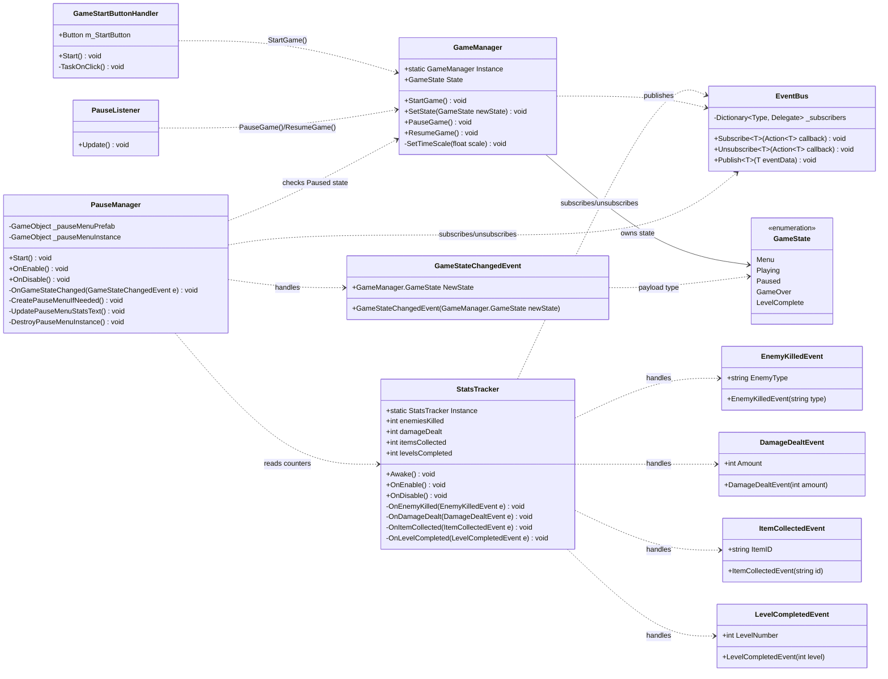

# UML Diagram: Stats + Pause + Start Button

```mermaid
classDiagram
    direction LR

    class EventBus {
      -Dictionary~Type, Delegate~ _subscribers
      +Subscribe~T~(Action~T~ callback) void
      +Unsubscribe~T~(Action~T~ callback) void
      +Publish~T~(T eventData) void
    }

    class StatsTracker {
      +static StatsTracker Instance
      +int enemiesKilled
      +int damageDealt
      +int itemsCollected
      +int levelsCompleted
      +Awake() void
      +OnEnable() void
      +OnDisable() void
      -OnEnemyKilled(EnemyKilledEvent e) void
      -OnDamageDealt(DamageDealtEvent e) void
      -OnItemCollected(ItemCollectedEvent e) void
      -OnLevelCompleted(LevelCompletedEvent e) void
    }

    class EnemyKilledEvent {
      +string EnemyType
      +EnemyKilledEvent(string type)
    }

    class DamageDealtEvent {
      +int Amount
      +DamageDealtEvent(int amount)
    }

    class ItemCollectedEvent {
      +string ItemID
      +ItemCollectedEvent(string id)
    }

    class LevelCompletedEvent {
      +int LevelNumber
      +LevelCompletedEvent(int level)
    }

    class GameStateChangedEvent {
      +GameManager.GameState NewState
      +GameStateChangedEvent(GameManager.GameState newState)
    }

    class GameManager {
      +static GameManager Instance
      +GameState State
      +StartGame() void
      +SetState(GameState newState) void
      +PauseGame() void
      +ResumeGame() void
      -SetTimeScale(float scale) void
    }

    class GameState {
      <<enumeration>>
      Menu
      Playing
      Paused
      GameOver
      LevelComplete
    }

    class GameStartButtonHandler {
      +Button m_StartButton
      +Start() void
      -TaskOnClick() void
    }

    class PauseListener {
      +Update() void
    }

    class PauseManager {
      -GameObject _pauseMenuPrefab
      -GameObject _pauseMenuInstance
      +Start() void
      +OnEnable() void
      +OnDisable() void
      -OnGameStateChanged(GameStateChangedEvent e) void
      -CreatePauseMenuIfNeeded() void
      -UpdatePauseMenuStatsText() void
      -DestroyPauseMenuInstance() void
    }

    StatsTracker ..> EventBus : subscribes/unsubscribes
    StatsTracker ..> EnemyKilledEvent : handles
    StatsTracker ..> DamageDealtEvent : handles
    StatsTracker ..> ItemCollectedEvent : handles
    StatsTracker ..> LevelCompletedEvent : handles

    GameManager ..> EventBus : publishes
    GameManager --> GameState : owns state

    GameStartButtonHandler ..> GameManager : StartGame()
    PauseListener ..> GameManager : PauseGame()/ResumeGame()

    PauseManager ..> EventBus : subscribes/unsubscribes
    PauseManager ..> GameStateChangedEvent : handles
    PauseManager ..> GameManager : checks Paused state
    PauseManager ..> StatsTracker : reads counters

    GameStateChangedEvent ..> GameState : payload type
```
